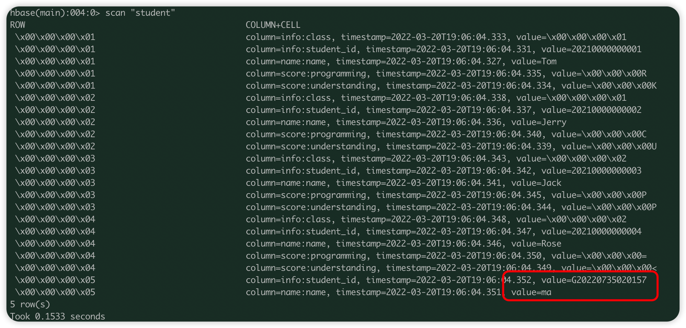

# Week 3 Homework
## 作业简介
使用JAVA API调用HBase，插入几行特定数据

## 实验思路
1. 将HBase操作封装在了一个Handler类里，通过类初始化建立HBase连接与admin   
2. 在Handler里实现了两个用于写操作的函数`putValue()`和`putRow()`,`putValue()`实现对一个cell的写操作，`putRow()`调用`putValue()`按照题目给定的格式进行写操作
3. 分别在自己电脑的docker环境，及服务器HBase环境中验证了结果

## 实验结果
**核心代码段**
```
    public void putValue(int rowKey, String colFamily, String colName, byte[] value)
            throws IOException{
        // 插入数据
        Put put = new Put(Bytes.toBytes(rowKey)); // row key
        put.addColumn(Bytes.toBytes(colFamily), Bytes.toBytes(colName), value); // col1
        conn.getTable(tableName).put(put);
        String str = new String(value, StandardCharsets.UTF_8);
        System.out.println("value of " + str + "  insert success");
    }
g
    public void putRow(int rowKey, String name, String student_id, int class_no, int understanding, int programming)
            throws IOException{
        putValue(rowKey, "name", "name", Bytes.toBytes(name));
        putValue(rowKey, "info", "student_id", Bytes.toBytes(student_id));
        putValue(rowKey, "info", "class", Bytes.toBytes(class_no));
        putValue(rowKey, "score", "understanding", Bytes.toBytes(understanding));
        putValue(rowKey, "score", "programming", Bytes.toBytes(programming));
        System.out.println("row of " + rowKey + "  insert success");
    }

    public void putRow(int rowKey, String name, String student_id)
            throws IOException{
        putValue(rowKey, "name", "name", Bytes.toBytes(name));
        putValue(rowKey, "info", "student_id", Bytes.toBytes(student_id));
    }
}
```

**实验结果**
服务器中切换到自己的命名空间后，scan查看结果

