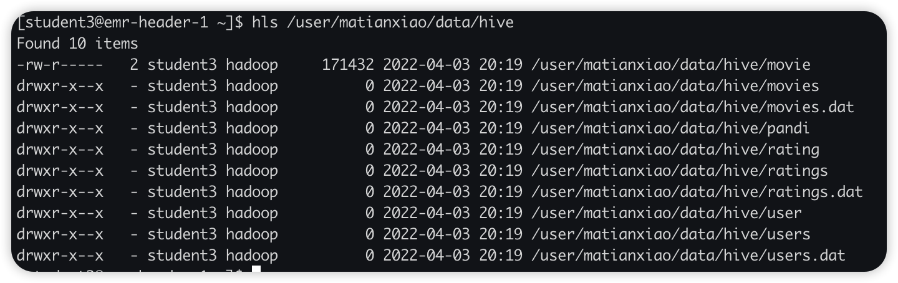
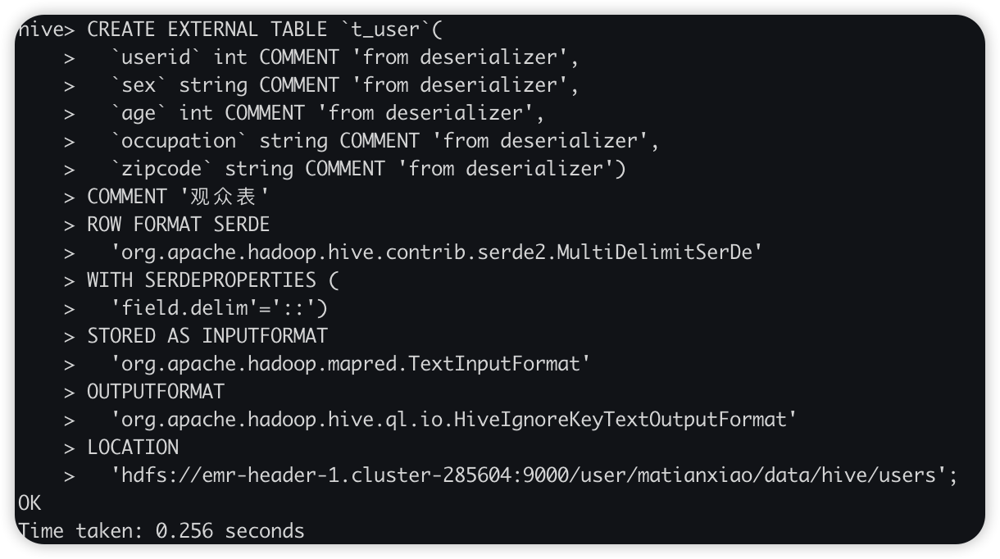
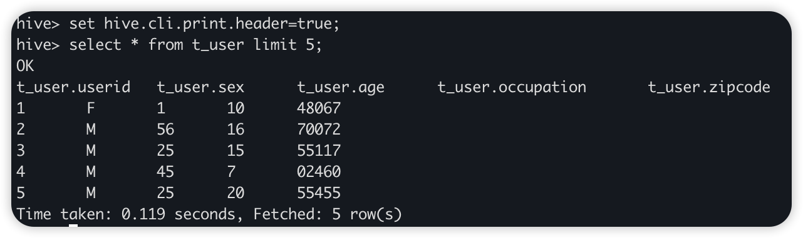
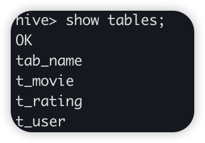
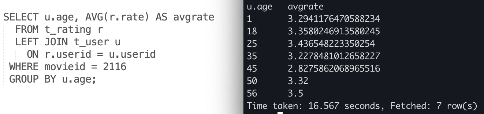
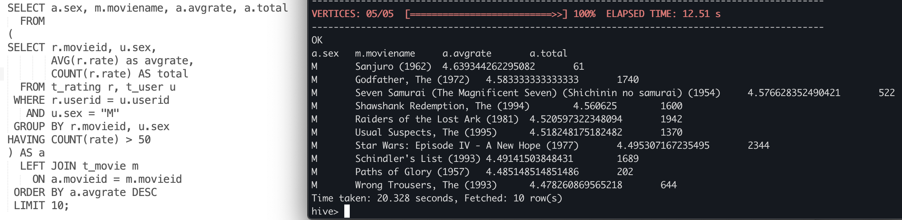

# Week 5
### 题目

### 解决方案
#### 1. 载入数据
将数据拷贝至自己文件夹下，并通过hive外表DDL落盘到hive  

在Hive CLI中，建立自己的数据库。  
使用show create table查看原表的DDL，将外表路径链接至自己的HDFS路径，使用修改后DDL建表，以user表DDL为例

查看建表是否成功

#### 2. 题目一  
白色部分为解决方案，右侧部分为结果展示。
思路：筛选出movieid符合条件的，然后rating user两表按userid join之后按组取均值。
思考：使用该方案时，hive是否自动做了谓词下推，优先筛选出movie id符合要求的，然后再join

#### 3. 题目二
思路：先和用户表join确定男性对电影的平均分，过滤出50条以上的，再和movie表join拉取名称信息

#### TODO
1. 题目三
2. 查看题目一的执行计划，看是否执行了谓词下推